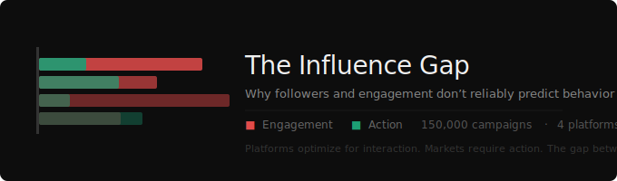

<p align="center">
  
</p>

<p align="center">
  
  
  
  
  
  
</p>

<br/>

# The Influence Gap
### Why Followers and Engagement Don't Reliably Predict Behavior

> *Platforms optimize for interaction. Markets require action. The gap between the two is where performance breaks.*

**[Live Dashboard →](https://llyles97-cmyk.github.io/influence-gap-analysis/influence_gap_dashboard.html)**

---

## Overview

*The Influence Gap* is a behavioral measurement framework that quantifies the structural disconnect between social engagement and real-world action. Using 150,000 influencer campaign records across four platforms, the project engineers four distinct power metrics — Reach, Interaction, Action, and Retention — to expose where platform-optimized behavior diverges from brand-relevant outcomes.

The output is a scored, segmented view of creator performance that redefines what "influence" actually means in a measurement context.

**This is not a study in how to pick better influencers. It is a critique of the measurement infrastructure the industry runs on.**

---

## Key Findings

- Engagement rate explains **less than 2% of conversion variance** across all four platforms (Pearson r: Twitter 0.018, Instagram 0.103, YouTube 0.126, TikTok 0.139)
- **Quiet Converters** — low-engagement, high-conversion creators — deliver **6,203× more action per engagement unit** than Engagement Traps, with 3× less raw engagement
- The Influence Gap is **structurally determined by platform architecture**: TikTok IGS +0.33, YouTube +0.04, Instagram −0.09, Twitter −0.44
- **Campaign type moves IGS as much as creator quality**: Seasonal Sale (+0.18) vs. Brand Awareness (−0.18) on the same platform
- Brands optimizing for engagement metrics are systematically overpaying for the wrong signal

---

## Framework

### The Four Power Metrics

| Dimension | Measures | Key Metric |
|---|---|---|
| **Reach Power** | Exposure potential | `impressions / followers` |
| **Interaction Power** | Platform engagement depth | `weighted_engagement_rate` |
| **Action Power** | Off-platform behavior | `action_yield`, `CTR`, `CVR` |
| **Retention Power** | Repeat behavior / loyalty | `audience_retention_index` |

### The Influence Gap Score

```
IGS = z(Action Score) − z(Interaction Score)
```

Positive IGS: action outpaces engagement. Creator converts more than their interaction metrics predict. **Underpriced.**

Negative IGS: engagement outpaces action. Audience performs for the platform, not the brand. **Engagement theater.**

IGS is not a ranking. It is a diagnostic.

### Creator Archetypes

| Archetype | IGS Range | Profile |
|---|---|---|
| **Quiet Converter** | > +1.5 | Low engagement, high conversion. Most underpriced creator in the market. |
| **Behavior-Positive** | +0.8 to +1.5 | Solid conversion relative to engagement |
| **Full-Funnel Creator** | Balanced high | Performs across all four dimensions. Rare. |
| **Spike Artist** | Near zero, high variance | Viral moments, no repeatability |
| **Ghost Amplifier** | Negative, low interaction | High reach, no resonance |
| **Platform Native** | −0.8 to −1.5 | Optimized for the feed, not the funnel |
| **Engagement Trap** | < −1.5 | High interaction, no conversion. Most overpaid creator in the market. |

---

## Data

**Dataset sample:** 10,000 rows (`random_state=42`, sampled from 150,000). All 22 columns intact. Platforms, archetypes, and categories are proportionally represented.

**Full dataset:** [Influencer Marketing ROI Dataset](https://www.kaggle.com/datasets/tfisthis/influencer-marketing-roi-dataset) on Kaggle. Run `influence_gap_engineering.py` against the full source to reproduce all 150,000 rows with derived metrics and archetype assignments.

**Platforms:** TikTok (29,984) · Instagram (59,819) · YouTube (45,139) · Twitter (15,058)

**Categories:** Beauty · Fashion · Food · Fitness · Travel · Tech · Gaming

**Campaign types:** Product Launch · Seasonal Sale · Brand Awareness · Giveaway · Event Promotion

### Engineered Fields

The base dataset contains reach, engagements, and sales. Three behavioral columns were derived using published platform benchmarks:

| Field | Method | Source |
|---|---|---|
| `clicks` / `ctr` | CTR × estimated_reach, platform-specific means with campaign-type multipliers | HypeAuditor State of Influencer Marketing 2024 |
| `conversions` / `conversion_rate` | CVR × clicks, platform + category multipliers | Influencer Marketing Hub Benchmark Report 2024 |
| `action_yield` | conversions / engagements | Derived |

**On methodology:** Real click and conversion data is proprietary to brands and agencies — it is never released publicly. Benchmark-anchored derivation is the standard approach for modeling expected performance in the absence of UTM-tracked campaign records. The need to model it is itself evidence of the measurement gap this project analyzes.

---

## Technical Stack

- **Python** (pandas, scipy, numpy) — data engineering, IGS computation, archetype assignment
- **SQL** — metric derivation logic (z-score normalization via window functions)
- **Chart.js** — interactive dashboard
- **Gamma** — presentation layer

---

## Project Files

```
banner.svg                       # Repository banner
influence_gap_sample.csv         # Dataset sample (10,000 rows x 22 columns)
influence_gap_engineering.py     # Full pipeline: cleaning -> metric engineering -> IGS -> archetypes
influence_gap_dashboard.html     # Standalone interactive dashboard (open in any browser)
The-Influence-Gap-v2.pptx        # 12-slide deck
README.md                        # This file
```

### Key Columns in Final Dataset

```
campaign_id, platform, influencer_category, campaign_type
estimated_reach, engagements, clicks, conversions, product_sales
engagement_rate, ctr, conversion_rate, action_yield
interaction_score, action_score, IGS, archetype
```

---

## Running the Analysis

```bash
pip install pandas scipy numpy

python influence_gap_engineering.py
```

Output: enriched dataset with all derived metrics and archetype assignments.

To reproduce on the full 150,000-row dataset, download the source from Kaggle and update the file path in the script.

---

## Product Implication

The framework points toward a creator intelligence layer — **InfluenceOS** — that scores and segments creators by IGS, archetype, and behavioral trend, updated after every campaign cycle. It replaces engagement-proxy shortlisting with action-based selection, and surfaces Quiet Converters before competitors find them.

Used by brand strategists, agencies, and DTC brands that need to know the difference between a Quiet Converter and an Engagement Trap before they sign the brief.

---

## Context

This project is part of a portfolio focused on measurement gaps in media and entertainment analytics — alongside work on Billboard vs. Spotify measurement discrepancies, streaming engagement vs. loyalty frameworks, and platform attention systems.

**Portfolio:** [lylesmomportfolio.my.canva.site](https://lylesmomportfolio.my.canva.site)

---

*Built with benchmark-anchored simulation on public campaign data. All methodology documented in `influence_gap_engineering.py`.*
